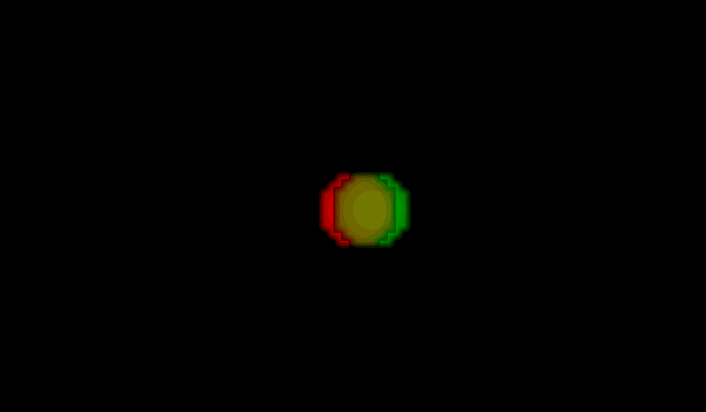

# Rigid Registration of Spheres
This notebook demonstrates how to create, visualize, and rigid register a dataset of spherical images using the `registration_tools` package.

## Index
- [Rigid Registration of Spheres](#rigid-registration-of-spheres)
  - [Index](#index)
  - [Import the corresponding libraries](#import-the-corresponding-libraries)
  - [Create an artificial dataset of spherical images](#create-an-artificial-dataset-of-spherical-images)
    - [Visualizing](#visualizing)
    - [Make video](#make-video)
  - [Register the images](#register-the-images)
    - [Check the correction of the registered images](#check-the-correction-of-the-registered-images)
    - [Make videos](#make-videos)


## Import the corresponding libraries


```python
import os
import napari
import registration_tools as rt #Main package
import registration_tools.data as rt_data #For generating artificial datasets
import registration_tools.visualization as rt_vis #For visualization
import registration_tools.registration as rt_reg #For registration
import zarr
```

## Create an artificial dataset of spherical images
We will create an artifitcial dataset of 10 spherical images with 3 channels.

By default, if a path is not specified, it will return a [zarr array](https://zarr.readthedocs.io/en/stable/user-guide/). This data type is great for storing big datasets in an eficient way and allow to upload data in memory by batches.


```python
# Create a dataset of spherical images
dataset = rt_data.sphere(
    out = None, #If not specified, a new dataset is created and stored in RAM
    num_images=10,
    image_size=50,
    num_channels=3,
    min_radius=5,
    max_radius=5,
    jump=2,
    stride=(1, 1, 1)
)
print("Type: ", type(dataset))
print("Shape: ", dataset.attrs["axis"])
print("Scale: ", dataset.attrs["scale"])
print("Shape: ", dataset.shape)
```

    Type:  <class 'zarr.core.array.Array'>
    Shape:  TCZYX
    Scale:  (1, 1, 1)
    Shape:  (10, 3, 50, 50, 50)


### Visualizing

Initialize the napari viewer to visualize the dataset.


```python
# Initialize the napari viewer
viewer = napari.Viewer()
```

and load the dataset to napari. The package provides some helpful functions to plot images generated during the pipeline.


```python
# Plot the images in the dataset
viewer.layers.clear() #Clear the viewer of other layers that may be present
rt_vis.add_image_difference(viewer, dataset)
rt_vis.add_image_difference(viewer, dataset)
# viewer.add_image(dataset, scale=dataset.attrs["scale"]) #This would have been equivalent to the above line.
viewer.dims.ndisplay = 3
```

### Make video

There is a convenient function to create videos from the current display in the napari viewer.


```python
# Make video
rt_vis.make_video(
    viewer=viewer,
    save_file='sphere_dataset.gif',
    fps=1,
)
```



## Register the images
Register the images in the dataset to correct for any misalignments.

First we generate the registration model. There are a few parameters to take into account:

 1. Pyramid levels. This indicates the coarse graining (block sizes) that will be used to register the images. The lower the number the smaller the blocks (0 will be pixel size). Smaller numbers will capture finer details but will be slower too. 
 2. Type of transformation (translation, registration, vectorfield...)
 3. Direction of registration (backward means finding a tranformation from future to past t+1 -> t)
 4. If to perform global transformation. That is, generate a set of transformations between t -> 0. In our case, since we just want to correct for the movement, we will set it to True.


```python
# Register the video
registration = rt_reg.Registration(
    pyramid_highest_level=3,           #Higher pyramid level
    pyramid_lowest_level=0,            #Lower pyramid level
    registration_type='translation',   #Type of registration
    registration_direction='backward', #Direction of registration
    perfom_global_trnsf=True           #Whether to perform global transformation
)
```

And then we apply it to the dataset. We use fit_apply to:

 1. Get the transformations.
 2. Apply the transformations to the dataset. 

The registration method can only work with one channel. If the data has different channels, you should specify which channel it should use for registering the data.


```python
dataset_registered = registration.fit_apply(    
    dataset=dataset,
    use_channel=0,     #Which channel to use for the registration.
    out=None,          #If not specified, a new dataset is created and stored in RAM
)
```

    Registering images using channel 0: 100%|██████████| 9/9 [00:00<00:00, 141.06/s]
    Applying registration to images: 100%|██████████| 9/9 [00:00<00:00, 192.57/s]


### Check the correction of the registered images

For that, we plot the original dataset and the registered one.


```python
# Make video projections
viewer.layers.clear() # Clear the viewer from past images
rt_vis.add_image(viewer, dataset[0], name="t0")
rt_vis.add_image(viewer, dataset, name="dataset", colormap="red")
rt_vis.add_image(viewer, dataset_registered, opacity=0.5, colormap='green', name="dataset_registered")
viewer.dims.ndisplay = 3
```

### Make videos

Now that we checked that the correction is satisfactory, we can save the video.


```python
# Make video registered
rt_vis.make_video(
    viewer=viewer,
    save_file='sphere_dataset_registered.gif',
    fps=1,
)
```


